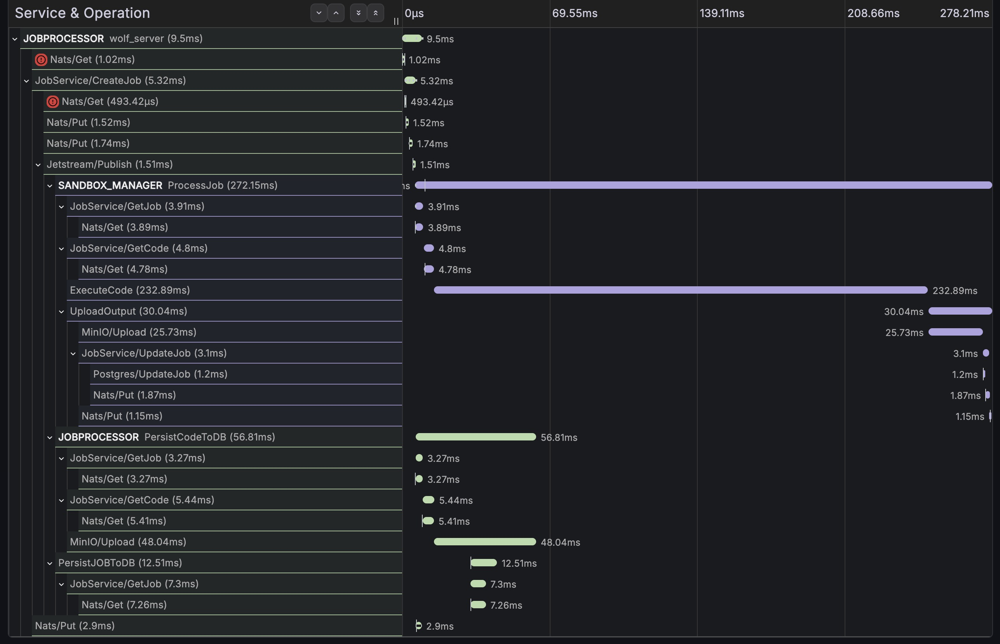
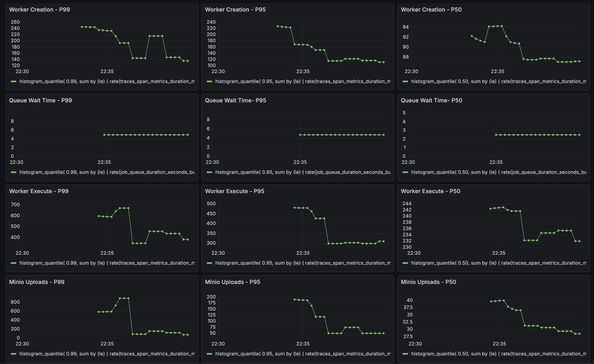
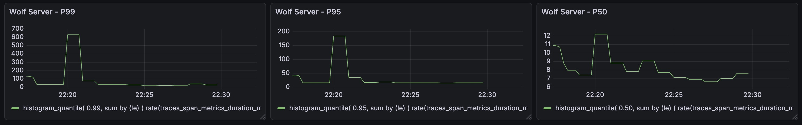

# Low-Latency Secure Code Execution Engine (Go)
A high-performance, strongly isolated, observable code execution system built for safety and low tail latency. This project demonstrates **distributed systems**, **sandboxing**, **observability**, and **failure-safe execution**, with deliberate tradeoffs between **security, performance, and reliability**.

---

## Overview / Motivation

Wolf is a system for safely executing untrusted code.

I built Wolf to deeply understand how platforms like online judges, AI code interpreters, and serverless runtimes run arbitrary user code without compromising the host machine. Rather than treating sandboxed execution as a black box, Wolf explores what it actually takes to build one from the ground up.

The goal is simple:

- Accept arbitrary code from anyone
- Execute it without risking the host system
- Maintain reliability, observability, and reasonable performance

What started as curiosity about sandboxing and isolation quickly became an exercise in real tradeoffs. Building Wolf forced me to confront questions that appear in production systems but are easy to gloss over in theory:

- How strict can isolation realistically be?
- How do you keep execution fast without weakening security?
- What does reliability mean when every input may be malicious?

Wolf is both a learning project and a practical exploration of secure execution under hostile conditions — focused less on abstractions and more on real constraints, failure modes, and design decisions.

### Architecture Diagram
                               +-----------------+
                               |     Client      |
                               +-----------------+
                                          |
                                          |  HTTP POST / submit job
                                          v
    +---------------------------------------------+
    |                Web Server                   |
    |   - Enforce max in-flight requests          |
    |   - Reject excess early (backpressure)      |
    +---------------------------------------------+
                                          |
                                          |  publish job
                                          v
    +---------------------------------------------+
    |          NATS JetStream                     |
    |   - Durable stream + work queue             |
    |   - Job ID published, payload stored        |
    +---------------------------------------------+
                   |                    |
       pull when   |                    | background /
       capacity    v                    v   async
    +----------------+     +-----------------------------+
    | Sandbox Manager|     | Background Goroutines       |
    |   - Maintains  |     |   - Independent retries     |
    |     worker pool|     |   - Transient failure safe  |
    |   - Pulls msg  |     +-----------------------------+
    |     only when  |               |             |
    |     idle worker|               v             v
    +----------------+       +----------------+  +----------+
                   |         |  PostgreSQL    |  |  MinIO   |
                   |         |  - job metadata|  |  - code  |
                   |         |  - initial     |  |  payload |
                   |         +----------------+  +----------+
                   |                    ^
                   |                    |
                   v                    |
    +---------------------------------------------+
    |              Worker                         |
    |   - Receives job via Unix Domain Socket     |
    |   - Itself is the isolated container        |
    |   - Executes in strict sandbox              |
    |   - Enforces CPU / memory / PID /           |
    |     syscall / network restrictions          |
    +---------------------------------------------+
                                          |
                                          |  writes stdout/stderr + files
                                          v
                               +-----------------+
                               | Execution Output|
                               |   - stdout /    |
                               |     stderr      |
                               |   - artifacts / |
                               |     files       |
                               +-----------------+
                                          ^
                                          |   Sandbox Manager reads
                                          |   (after worker completes)
                                          |
    +---------------------------------------------+
    |      Sandbox Manager (post-execution)       |                       
    +---------------------------------------------+
                   |                  |                  |
                   v                  v                  v
         +----------------+  +----------------+  +-----------------+
         |     MinIO      |  |  PostgreSQL    |  |   JetStream     |
         |  - output      |  |  - status      |  |  (message ACKed)|
         |  - logs        |  |  - duration    |  |   → msg removed |
         +----------------+  |  - metadata    |  +-----------------+
                             +----------------+
                                          ^
                                          |
                               Job completed

> API ( Web Server ) can be scaled horizontally behind a load balancer. Sandbox managers are stateless and can also be scaled independently — each consumes independently from the JetStream work queue.

## 🔄 Job Flow

- Client submits job to the Web Server
  - Web server enforces max concurrent in-flight requests per instance
  - Excess requests are rejected early to apply backpressure
- Web Server publishes job to NATS JetStream
  - Job payload and metadata are written to JetStream durable storage
  - Job ID is published to the JetStream stream/queue
- Background goroutines persist job data
  - Job metadata persisted to Postgres
  - Code payload persisted to MinIO
  - Persistence is retried independently on transient failures
- Sandbox Manager processes jobs
  - Waits for an idle worker before pulling messages
  - Pulls job from JetStream only when capacity is available
  - Assigns job to worker via Unix Domain Socket
  - Reserves worker for exclusive execution
- Worker executes job
  - Runs job inside a sandboxed container
  - Enforced CPU, memory, PID, syscall, and network restrictions
- Execution results persisted
  - Job output persisted to MinIO
  - Job status and execution metadata updated in Postgres
- JetStream message acknowledged
  - Message is ACKed only after successful persistence
  - Ensures at-least-once execution and crash safety

---

## Highlights

- Isolation-per-worker execution using **containerd, AppArmor, Seccomp, and cgroups**
- Backpressure-aware scheduling with explicit worker availability tracking
- At-least-once job execution semantics via **NATS JetStream**
- End-to-end observability with tracing and metrics across all components
- Failure-safe execution: worker crashes, retries, and persistence handled correctly
- Extensible architecture supporting future runtimes
---

## Key Features

### 🔒 Secure Isolation
- One Job per Worker
- Enforced using:
  - cgroups (CPU, memory, PIDs)
  - AppArmor and Seccomp (syscall restrictions)
- No network access for workers
- Fork bombs and resource exhaustion prevented

---

### 🧠 End-to-End Backpressure-Aware Scheduling
- Web layer: caps concurrent requests per instance, rejects early (load shedding at ingress)
- Queue layer: enforces max pending limit, sheds excess messages instead of buffering forever
- Sandbox layer: pull-based dispatch — jobs only sent when workers are confirmed ready
- Result: no queue flooding, no cascading OOM, stable p99 latency under overload
---

### 🔁 At-Least-Once Execution
- Jobs acknowledged in JetStream **only after successful persistence**
- Automatic retries on: worker crashes + transient failures
- Guarantees durable and correct results

---

### ⚡ Fast IPC
- Unix Domain Sockets + gRPC between Sandbox Manager and Worker
- Low overhead, local communication
- Designed for high-frequency job dispatch

---

### 🔍 Observability
- End-to-end tracing: Web Server → Queue → Sandbox Manager → Worker → Storage



- Metrics per stage:
  - server 
  - queue wait time
  - job execution time
  - storage latency
  - worker creation time



- Enables root-cause analysis:
  > *“Why did Job X take 3 seconds?”*

---

## Performance
### Measured Latency (Local / 10-core VM, 12GB RAM) - 5 RPS
| Stage                     | p50 (ms) | p95 (ms) | p99 (ms) |
|---------------------------|----------|----------|----------|
| Worker creation           | 94.2     | 227      | 245      |
| Queue wait time           | 2.50     | 4.75     | 4.95     |
| Worker execution time     | 242      | 480      | 671      |
| Minio Uploads             | 40       | 190      | 888      |
| Wolf server               | 11.5     | 25.9     | 68.6     |

> Note: Latency is mostly execution + storage I/O, not orchestration.
---

## 📦 Tech Stack

- Go
- containerd / docker
- NATS JetStream
- Postgres
- MinIO
- OpenTelemetry / Prometheus / Grafana / alloy / tempo 
- AppArmor / Seccomp / cgroups

## 🧠 Design Reasoning

- Isolation vs startup latency → pre-warmed workers
- Reliability → at-least-once + durable ack after persistence
- Backpressure → explicit worker tracking instead of unbounded queues
- IPC → Unix domain sockets + gRPC
- Observability-first design → helps debugging and system evolution.

---

## 💻 Getting Started

### 1. Start the environment
Deploy all components inside a Multipass VM:
```bash
make init
```
### 2. Find the VM IP address
Get the IP address of the running VM:
```
multipass info <vmname>
``` 
### 3. Submit a job
Send a job to the Web Server using a POST request:
```
curl -X POST http://<VM-IP>:8080/job \
  -H "Content-Type: application/json" \
  -d '{
    "code": "#include <bits/stdc++.h>\nusing namespace std;\n\nint main() {\n    cout << \"Hello World\";\n    return 0;\n}",
    "executionEngine": "c++"
  }'
```
Replace <VM-IP> with the IP address obtained from multipass info.

#### Example Response
```
{
    "id": "50c4d683-d15c-46b4-ad49-1b9a234e1ad3",
    "executionEngine": "c++",
    "codePath": "jobs/50c4d683-d15c-46b4-ad49-1b9a234e1ad3/code.bin",
    "codeHash": "e2a7639a3394c64f1db109a97c7a3dd37ada455640b3fa70e11599991a956ed9",
    "status": "Pending",
    "creationTime": "2025-12-16T00:50:23.505604197+05:30",
    "retryCount": 0,
    "tags": null
}
```

### 4. Get job status
Retrieve the job status:
```
curl http://<VM-IP>:8080/job/<job-id>
```

#### Example Response
```
{
    "id": "50c4d683-d15c-46b4-ad49-1b9a234e1ad3",
    "executionEngine": "c++",
    "codePath": "jobs/50c4d683-d15c-46b4-ad49-1b9a234e1ad3/code.bin",
    "codeHash": "e2a7639a3394c64f1db109a97c7a3dd37ada455640b3fa70e11599991a956ed9",
    "status": "Completed",
    "outputPath": "jobs/50c4d683-d15c-46b4-ad49-1b9a234e1ad3/output.log",
    "creationTime": "2025-12-16T00:50:23.505604197+05:30",
    "endTime": "2025-12-16T00:50:24.125136564+05:30",
    "retryCount": 0,
    "outputHash": "fc18dad7662e24cb9d7820aeaff799143d07f81b0d63a9303af6d1f19dd99811",
    "tags": null
}
```

### 5. Download Output
Download the output once the job status is 'completed'
```
curl http://<VM-IP>:8080/job/<job-id>/output
```
#### Example Response
```
Hello World
```

## 📈 Dashboard
Enter the below URL and navigate to Dashboards->Code execution->Engine
```
http://<VM-IP>:3000
```



## Production Hardening Items – Not Yet Implemented
These are intentional trade-offs made for a portfolio / demonstration project. In a real production deployment, the following areas would be addressed:

**Authentication & Authorization**

No built-in auth (API keys, JWT, OAuth) — assumed to be handled by an upstream API gateway / reverse proxy.

**Rate Limiting & Abuse Prevention**

No global request limiting exists, no per-user / per-IP quotas or CAPTCHA/WAF-like defenses against code-submission spam.

**Dead-Letter Queue (DLQ) Processing**

Poison-pill / repeatedly failing jobs stay in the stream or get dropped after max deliveries. No automated DLQ consumer or alerting for manual inspection.

**Advanced Code Content Validation**

Binary / malicious file uploads fail at compilation, but no pre-compilation content scanning (magic bytes, virus signatures, restricted keywords).